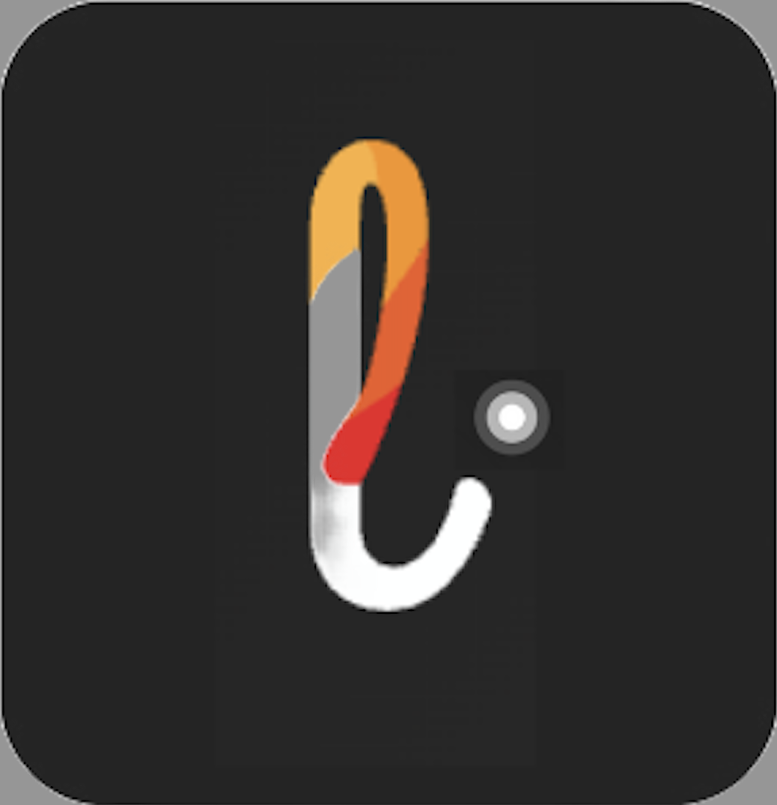

# LightPing

[](https://github.com/yourusername/LightPing)



LightPing is a Flutter mobile application designed to detect light changes through your camera and notify you. Perfect for couriers, delivery personnel, or anyone waiting for a light signal (like a porch light turning on).

## Features

- **Light Change Detection**: Uses camera feed to detect light changes ("pings")
- **Real-time Notifications**: Sends both in-app and SMS notifications when a light ping is detected
- **Camera Controls**: Easily switch between front and rear cameras
- **Clean UI**: Minimalist interface with camera feed and status indicators
- **Always-On Display**: Keeps the screen active while monitoring
- **Phone Number Integration**: Set up SMS notifications to your preferred phone number

## How It Works

The app displays a camera feed in the center of the screen with a status indicator above it showing either "NO CURRENT PING" or "PING DETECTED, VERIFY?" When a light change is detected, the app sends both an Android notification and an SMS to the configured phone number.

## User Interface

- **Clean, Minimalist Design**: The UI focuses on functionality with a clear visual hierarchy
- **Camera Feed**: Displayed in a centered, nicely styled container
- **Status Indicator**: Large text at the top showing current ping status
- **Counter**: Small text showing the number of light pings detected
- **Camera Switch Button**: Below the camera feed for easy switching between cameras
- **Phone Number Display**: Shows in the app bar with the ability to update by tapping the logo

## Technical Implementation

### Light Detection Algorithm

The application uses a custom HSV-based approach for detecting light changes in the camera feed, which works for any color of light (not just white light):

- **HSV Color Space**: Converts RGB to HSV (Hue, Saturation, Value) for better light intensity detection
- **Light Intensity Calculation**: Combines value (brightness) and saturation to detect intense light sources regardless of color
- **Color-Agnostic Detection**: Works with red, blue, rainbow, or any colored light sources
- **Change Detection**: Compares the current frame's intensity with the previous one to detect significant changes
- **Threshold Configuration**: Uses a configurable threshold to determine what constitutes a "light ping"

The algorithm efficiently samples pixels from each frame rather than processing every pixel, making it performant even on older devices.

### SMS Notification System

The app uses TextBelt API for sending SMS notifications when light changes are detected:

- **Free Tier Integration**: Uses TextBelt's free tier, which allows one SMS per day per IP address
- **International Support**: Works with international phone numbers in E.164 format
- **Error Handling**: Provides feedback when SMS sending fails or quota is exceeded

Phone numbers are stored locally using SharedPreferences and can be easily updated through the UI by tapping on the logo.

Phone numbers should be in international format (e.g., +1 234 567 8901) with the country code included for proper routing.

### Other Technical Features

- **Screen Wake Lock**: Prevents device from sleeping while monitoring
- **Local Notifications**: Android notifications when light changes are detected
- **Camera Management**: Proper lifecycle handling for camera resources
- **State Persistence**: Saves user preferences between sessions

## Getting Started

When first installed, the app presents a loading screen with the LightPing banner, followed by a phone number setup screen. The user can later change this number by tapping the LightPing logo in the top-left corner.

### Required Dependencies

```yaml
dependencies:
  camera: ^0.10.5+9                  # Camera access
  wakelock_plus: ^1.1.4             # Keep screen on
  shared_preferences: ^2.2.2         # Local storage
  flutter_local_notifications: ^16.3.0  # Notifications
  http: ^1.1.0                      # HTTP requests for TextBelt API
  # No longer using TensorFlow Lite - using custom HSV-based light detection
  image: ^4.0.17                    # Image processing
```

## Implementation Notes

- The app has been configured to use the logo_curved.png for all Android app icons
- The app name has been set to "LightPing" with proper capitalization across all platforms
- The app enforces screen-on state using the WakelockPlus package
- Java 8 desugaring (version 2.1.4+) is enabled in Android builds to support the flutter_local_notifications package

## Build Requirements

- Android: Minimum SDK 21, Target SDK 31+
- iOS: iOS 11+
- Flutter: Latest stable version recommended
